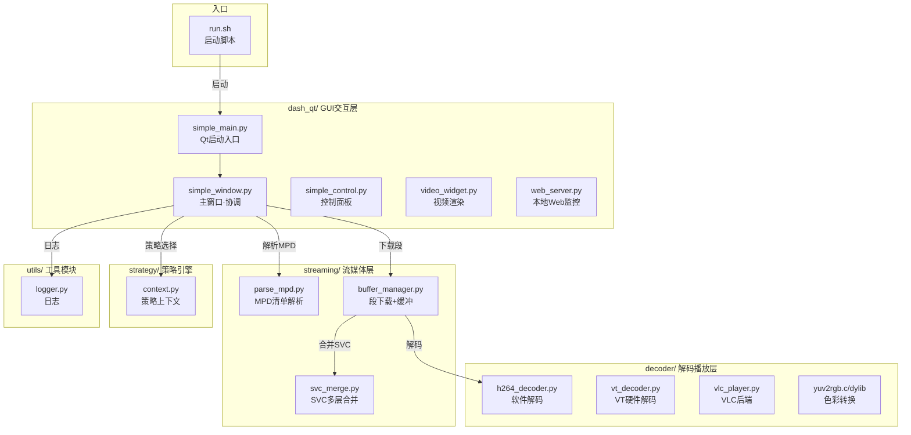
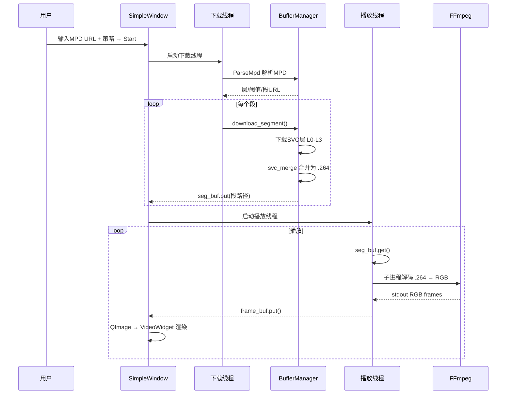

# SVC-DASH Player

DASH (Dynamic Adaptive Streaming over HTTP) 客户端播放器，支持 SVC (Scalable Video Coding) 多层自适应码率视频流。

## 架构



## 数据流



## 项目结构

```
SVC_DASH/
├── run.sh                         # 唯一入口
├── README.md
├── .gitignore
├── dash_qt/                       # GUI 交互层
│   ├── simple_main.py             # Qt 启动入口
│   ├── simple_window.py           # 主窗口（下载/播放协调）
│   ├── simple_control.py          # 控制面板
│   ├── video_widget.py            # 视频渲染
│   ├── web_server.py              # 本地 Web 监控
│   └── dialogs/                   # 对话框
├── streaming/                     # DASH 流媒体下载层
│   ├── buffer_manager.py          # 段下载 + 缓冲管理
│   ├── parse_mpd.py               # MPD 清单解析
│   └── svc_merge.py               # SVC 多层合并
├── decoder/                       # 视频解码播放层
│   ├── h264_decoder.py            # H.264 软件解码
│   ├── vt_decoder.py              # VideoToolbox 硬件解码 (macOS)
│   ├── vlc_player.py              # VLC 播放器后端
│   ├── yuv2rgb.c / yuv2rgb.dylib  # YUV→RGB 色彩转换
│   └── vt_decode / .m / .swift    # VT 原生解码
├── strategy/                      # 自适应策略引擎
│   ├── base.py                    # 策略基类
│   ├── context.py                 # 策略上下文
│   └── fixed.py                   # 固定质量策略
├── utils/                         # 工具模块
│   ├── logger.py                  # 日志配置
│   ├── log_utils.py               # 日志工具
│   └── pykeyboard.py              # 键盘模拟
├── scripts/                       # 辅助脚本
│   └── bandwidth.sh               # 远程带宽测试
└── tests/                         # 测试
```

## 主要功能

- **自适应码率**: 策略模式支持多种自适应算法 (threshold / qlearning / fixed)
- **边下边播**: 段级 FIFO 缓冲，段 0 开始即可播放，无需等待全部下载
- **SVC 多层合并**: `streaming/svc_merge.py` 合并 L0+L1+L2+L3 增强层为 H.264 可解码流
- **暂停/继续**: ⏯ 冻结帧显示 + 暂停 FFmpeg 解码
- **停止/重载**: ⏹ 终止 FFmpeg、清空队列、删除临时文件、重置 UI
- **Seek 跳转**: 拖拽滑块跳转到任意段，自动重建缓冲并恢复播放
- **本地文件服务器**: 支持 `http://127.0.0.1:8087` 数据集
- **实时统计**: 下载速度、带宽、缓冲占用、段进度实时显示

## 快速开始

```bash
# 安装依赖
pip install PySide6

# 启动本地文件服务器（如使用本地数据集）
python3 -m http.server 8087 --bind 127.0.0.1

# 启动播放器（两种方式等效）
bash run.sh
# 或
python3 dash_qt/simple_main.py
```

## 引用的第三方软件

| 软件 | 版本 | 用途 | 许可证 | 链接方式 |
|------|------|------|--------|----------|
| **FFmpeg** | 7.0.2 | H.264 解码 (.264→RGB) | LGPL 2.1+ / GPL 2+ | 子进程 (stdout管道) |
| **PySide6** | 6.10+ | Qt GUI 框架 | LGPL 3.0 | Python import |
| **Python** | 3.9+ | 运行环境 | PSF License | 系统安装 |

### FFmpeg 许可说明

FFmpeg 通过**独立子进程**调用 (`subprocess.Popen`)，Python 与 FFmpeg 之间通过 stdout 管道通信，属于"独立进程间通信"而非代码链接。根据 FFmpeg 官方许可 FAQ 和 LGPL 条款，此类用法不触发 LGPL 的 copyleft 义务，无需开源本项目代码。

### PySide6 许可说明

PySide6 (Qt for Python) 使用 **LGPL v3** 许可证，可免费用于商业闭源项目。与 PyQt6 (GPL/商业双许可) 不同，PySide6 是 Qt 官方 LGPL 版本，闭源商用无需购买许可。

## 自研组件

| 组件 | 位置 | 说明 |
|------|------|------|
| `yuv2rgb.c / dylib` | `decoder/` | YUV420→RGB888 C 语言转换库 |
| `svc_merge.py` | `streaming/` | SVC 多层 NAL 单元合并 |
| `parse_mpd.py` | `streaming/` | DASH MPD 清单 XML 解析器 |
| `buffer_manager.py` | `streaming/` | 段下载 + 缓冲管理 + 自适应协调 |
| `strategy/` | `strategy/` | 自适应码率策略框架 |
| `simple_window.py` | `dash_qt/` | Qt GUI 主窗口 |

## 运行测试

```bash
pytest tests/ -v
```

## 许可

MIT License
